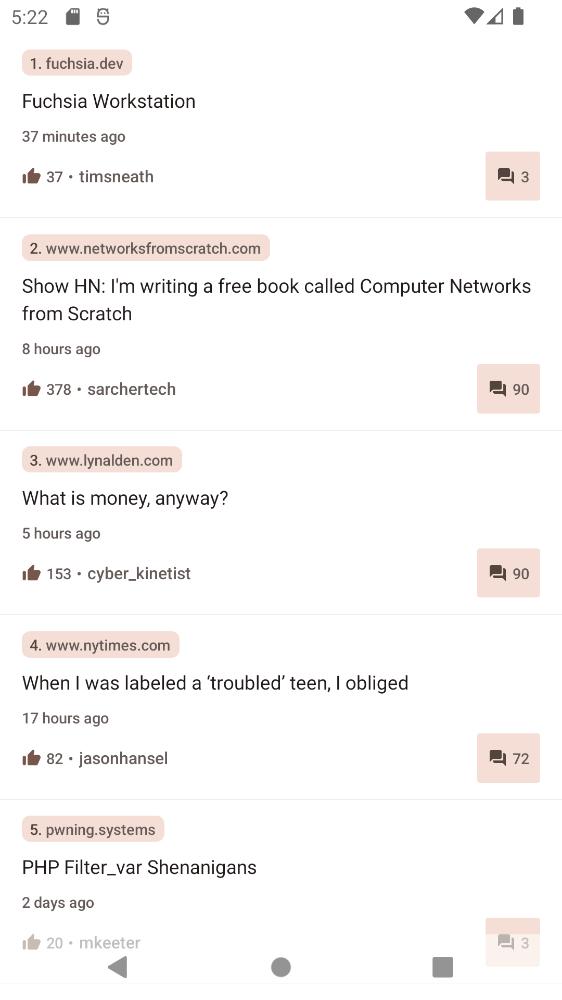
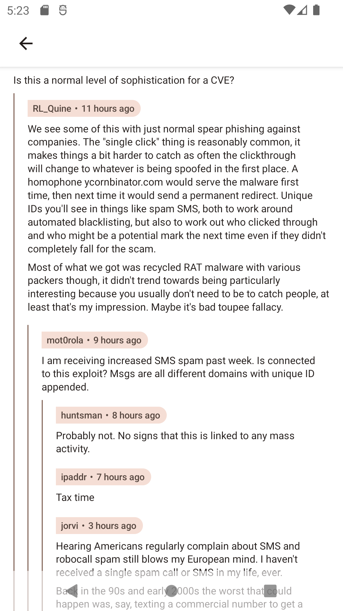
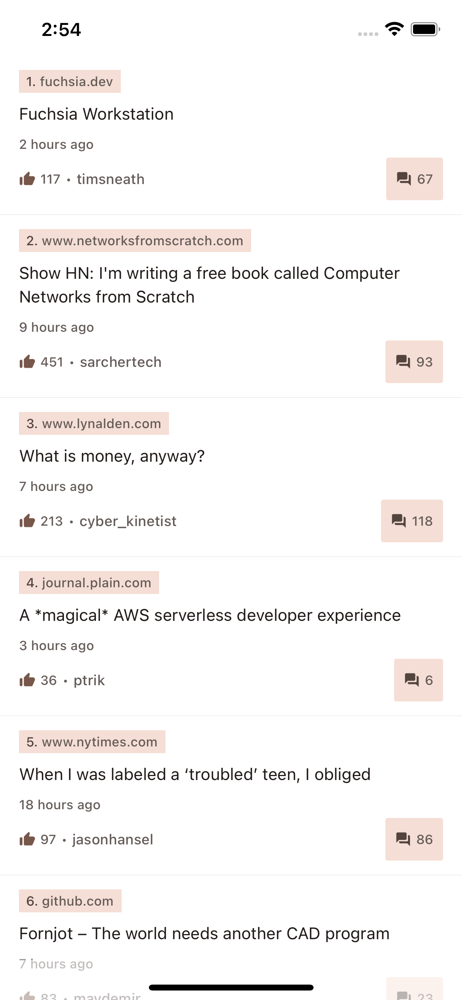

# Hacker News - React Native

## Overview

This project is setup to follow unidirection data flow and single source of truth approach.
We mainly use `Redux` as well as `TypeScript` for better typed coding.

### Prerequisite

- [Node](https://nodejs.org/en/) >= 16.10
- Xcode for iOS (To run iOS on Mac)
- Ruby == 2.7.4 (only needed for cocoapods on Mac)
- [Bundler](https://bundler.io/) >= 2.3.10 (to make sure everyone has same cocoapods version for this project)
- Java JDK (Install Android Studio come with JDK, and setup your JAVA_HOME with the JDK come with Android Studio)
- Yarn v1 (a.k.a. **classic**)

### Prerequisite installation

- For iOS, follow MacOS [setup instruction](./.docs/SETUP_MACOS.md)
- For Windows, follow Windows [setup instruction](./.docs/SETUP_WINDOWS.md)

## Install Android Studio

You can install Android Studio via [Jetbrains Toolbox](https://www.jetbrains.com/lp/toolbox/) to easier manage multiple version of Studio or [The Official Website](https://developer.android.com/studio)

Remember to setup `JAVA_HOME` and `ANDROID_HOME` by following the [React-Native Website](https://reactnative.dev/docs/environment-setup)

## Install Yarn (Ensure you are using Node >= 16.10)

```sh
corepack enable
```

Note: If you are Yarn v2+, you will need to fallback to Yarn v1 because we are using `prepare` lifecycle script for `cocoapods`.

Run below comment and delete all related `.yarn*` files in the project

```sh
yarn set version classic
```

## Initial project

> Just `Yarn`, don't worry about cocoapods if you follow the MacOS setup instruction

```sh
yarn
```

## TODO

- More code coverage
- Offline caching for feed
- Display more friendly error message, such as Offline
- Display error message when user doing Pull-to-Refresh with some kind of SnackBar pattern
- Handle error for next page fetching

## Screenshots

### Android




### iOS



